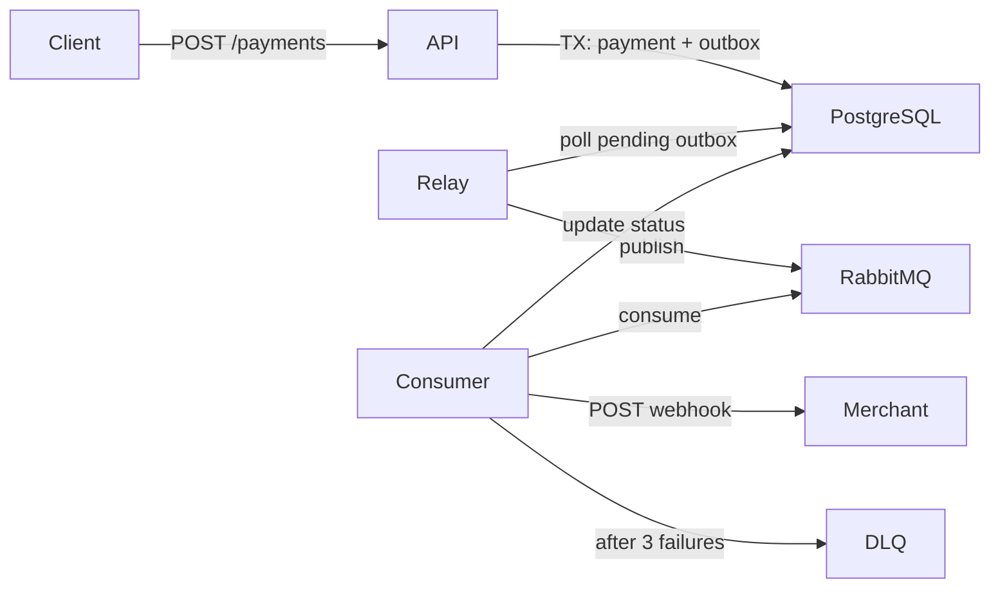

# Payment Service

Production-ready microservice for **asynchronous payment processing** with the **Transactional Outbox** pattern, RabbitMQ (FastStream), and webhook delivery with retries.

## Architecture



### Flow

1. **API** accepts payment request (202 Accepted), saves `Payment` + `OutboxEvent` in a single DB transaction.
2. **Outbox relay** (background task in consumer) polls pending outbox rows and publishes to RabbitMQ.
3. **Consumer** simulates processing (2–5s delay, 90% success), updates payment status, sends webhook with exponential backoff (3 retries).
4. On **3 processing failures**, message is routed to **Dead Letter Queue** (`payment.process.dlq`).

## Tech Stack

- Python 3.11+, FastAPI, Uvicorn
- SQLAlchemy 2.0 (async) + asyncpg + Alembic
- Pydantic v2, FastStream (RabbitMQ), httpx
- PostgreSQL, RabbitMQ, Docker, uv

## Quick Start (Docker)

```bash
cd payment-service
cp .env.example .env
docker compose up --build
```

Services:

| Service   | URL / Port                          |
|-----------|-------------------------------------|
| API       | http://localhost:8000               |
| Swagger   | http://localhost:8000/docs          |
| RabbitMQ  | http://localhost:15672 (guest/guest)  |
| PostgreSQL| localhost:5432                      |

## Local Development (without Docker)

### Prerequisites

- Python 3.11+
- [uv](https://docs.astral.sh/uv/)
- Running PostgreSQL and RabbitMQ

### Setup

```bash
cd payment-service
cp .env.example .env
# Edit .env: set DATABASE_URL and RABBITMQ_URL for localhost

uv sync
uv run alembic upgrade head

# Terminal 1 — API
uv run uvicorn app.main:app --reload --host 0.0.0.0 --port 8000

# Terminal 2 — Consumer + Outbox relay
uv run python -m app.brokers.consumer
```

## API Examples

### Create Payment

```bash
curl -X POST http://localhost:8000/api/v1/payments \
  -H "Content-Type: application/json" \
  -H "X-API-Key: change-me-in-production" \
  -H "Idempotency-Key: order-12345-unique-key" \
  -d '{
    "amount": "1500.50",
    "currency": "RUB",
    "description": "Order #12345",
    "metadata": {"order_id": "12345", "customer_id": "cust-99"},
    "webhook_url": "https://webhook.site/your-unique-id"
  }'
```

**Response (202 Accepted):**

```json
{
  "payment_id": "pay_a1b2c3d4e5f67890",
  "status": "pending",
  "created_at": "2026-06-16T12:00:00+00:00"
}
```

### Get Payment

```bash
curl http://localhost:8000/api/v1/payments/pay_a1b2c3d4e5f67890 \
  -H "X-API-Key: change-me-in-production"
```

### Idempotency

Repeat the same request with the same `Idempotency-Key` — you'll get the original payment without creating a duplicate.

## Environment Variables

| Variable                      | Description                          | Default                                      |
|-------------------------------|--------------------------------------|----------------------------------------------|
| `API_KEY`                     | Static API key for authentication    | `change-me-in-production`                    |
| `DATABASE_URL`                | Async PostgreSQL URL                 | see `.env.example`                           |
| `RABBITMQ_URL`                | RabbitMQ connection URL              | see `.env.example`                           |
| `OUTBOX_POLL_INTERVAL_SECONDS`| Outbox relay poll interval           | `1.0`                                        |
| `PROCESSING_SUCCESS_RATE`     | Simulated success rate (0.0–1.0)     | `0.9`                                        |
| `WEBHOOK_MAX_RETRIES`         | Webhook retry attempts               | `3`                                          |
| `CONSUMER_MAX_RETRIES`        | Processing retries before DLQ        | `3`                                          |

## Project Structure

```
payment-service/
├── app/
│   ├── main.py              # FastAPI application
│   ├── core/                # Config, DB, security
│   ├── api/v1/              # REST endpoints
│   ├── models/              # SQLAlchemy models
│   ├── schemas/             # Pydantic DTOs
│   ├── services/            # Business logic + Outbox
│   ├── brokers/consumer.py  # FastStream consumer + relay
│   └── utils/retry.py       # Exponential backoff
├── alembic/                 # Migration config
├── migrations/versions/     # Migration scripts
├── tests/
├── docker-compose.yml
└── Dockerfile
```

## Testing

```bash
uv run pytest -v
```

## Migrations

```bash
# Apply migrations
uv run alembic upgrade head

# Generate new migration (after model changes)
uv run alembic revision --autogenerate -m "description"
```

## Monitoring

- **RabbitMQ Management UI**: http://localhost:15672 — inspect queues `payment.process` and `payment.process.dlq`
- **Logs**: `docker compose logs -f api consumer`

## Design Notes

- **Outbox Pattern**: guarantees at-least-once delivery to RabbitMQ even if the broker is temporarily unavailable.
- **Idempotency**: `Idempotency-Key` header prevents duplicate payments on client retries.
- **DLQ**: failed messages after 3 processing attempts are published to `payment.process.dlq` for manual inspection.
- **Webhook retries**: independent exponential backoff (1s, 2s, 4s) before marking processing as failed.
